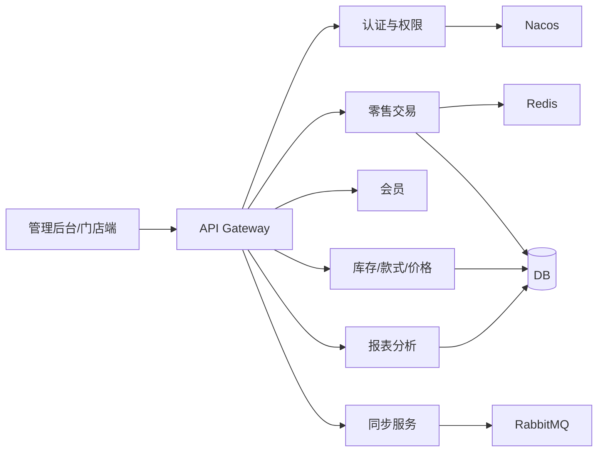

# 💎 珠宝行业加盟零售 POS 系统（SaaS 多租户）

::: info 说明
总结系统的功能覆盖、技术架构、核心设计亮点
:::

## 1. 项目概述

该系统面向珠宝行业连锁/加盟场景，提供「门店收银 + 运营管理」一体化能力：

- 总部统一标准：基础资料、价格策略、部分业务规则下发
- 加盟商/门店差异化：权限、字段展示、报表维度、业务参数按租户配置
- 数据闭环：门店交易、库存、会员与运营数据汇总分析，并与外部 ERP 等系统同步

> 典型角色：总部、加盟商、店长、导购、财务等（权限按角色与层级控制）。

---

## 2. 业务范围（模块清单）

系统核心菜单/业务覆盖（与操作手册一致）：

- **系统管理**：仓库信息、机构管理、用户管理、基础参数等  
- **权限管理**：合同发起签署-网点端口开放-新增租户-同租户多门店、菜单与操作权限配置（支持不同层级可见数据差异）  
- **基础信息**：库存预警设置、销售分析设置、自定义大类等  
- **会员管理**：会员等级、积分规则、积分抵现、代金券、礼品、标签等  
- **库存管理**：总部发货、第三方入库、其它出入库、调拨/收货、借还、盘点、在途库存、已售维修等  
- **价格管理**：网点金价、折扣权限、营销活动、盘价、成本调价、属性调整等  
- **提成管理**：员工业绩目标、提成规则、明细/汇总报表等  
- **旧料管理**：旧料调拨/收货、旧料出库、旧料库存明细等  
- **备品/赠品管理**：备品/赠品信息、出入库、调拨、库存等  
- **零售管理**：零售单、定金单、收入支出、班组交接等  
- **报表与管控分析**：销售明细/汇总、库存收发存、畅滞销、库存预警、销售分析等  

::: tip 为什么这些模块重要
珠宝零售区别于快消：**一货一码、价格/金价联动、旧料回收/置换、提成规则复杂、盘点与在途严格**。模块越全，说明系统越接近真实行业落地。
:::

---

## 3. 技术架构

### 3.1 技术栈

- 微服务：Spring Cloud（含 Gateway）
- 注册/配置中心：Nacos
- 消息中间件：RabbitMQ
- 缓存：Redis
- 数据库：MySQL / Oracle（按业务域选择）
- 部署交付：Docker
- CI/CD：Jenkins

### 3.2 架构简图

---

## 4. SaaS 多租户设计（项目核心）

### 4.1 多租户目标

- 同一套系统同时服务多个加盟商（租户）
- 租户间数据隔离、配置隔离、权限隔离
- 租户可按业务需要进行差异化配置（例如报表字段、菜单展示、参数等）

### 4.2 租户隔离方式（简述）

- **数据隔离**：业务数据绑定 `tenant_id`（行级隔离）
- **链路透传**：网关鉴权解析 token，将 `tenantId` 下发至服务侧上下文
- **权限隔离**：按角色层级控制菜单与操作权限，支持不同层级可见字段/数据范围

---

## 5. 关键设计亮点）

## 5.1 租户自定义字段导出 Excel

业务诉求：不同租户对同一报表/明细的导出字段要求不同，需要“自选字段导出”。

方案要点：

- **字段配置模型**：按“租户 + 菜单/报表”维度维护可导出字段集合
- **缓存策略**：启动或首次访问加载配置到缓存（按菜单维度），避免频繁查库
- **导出组装**：导出时根据租户选择生成动态表头与列顺序
- **赋值方式**：通过反射/映射进行字段取值与填充，避免大量 if/else 硬编码  
  - 可缓存反射元数据（Field/Method）降低反射开销

**收益**：配置驱动、减少定制开发、同一套导出服务适配多租户。

---

## 5.2 MQ 异步化解耦（提升交易主链路稳定性）

- 将「ERP 同步、报表汇总、部分非核心处理」通过 RabbitMQ 异步化
- 设计合理的消息结构与路由，确保数据一致性与可靠性（例如使用事务消息、幂等消费等机制）
- 交易主流程优先保证：**收银体验、单据生成、核心落库**
- 外部系统抖动时，通过异步消费与重试/补偿降低对主链路影响

> 面试延展：幂等、重复消费、失败重试、死信队列与补偿策略（视你实际落地情况选择回答深度）。

---

## 5.3 运营看板与管控分析

管理后台提供关键经营指标与分析能力（例如会员、销售、库存、畅滞销、库存预警等），用于总部/加盟商快速判断门店经营状态并指导运营动作。

---

## 6. 我的职责与贡献

- 参与 **SaaS 多租户能力落地**：租户上下文透传、权限与配置联动
- 参与/负责 **运营后台与业务域** 功能开发与联调（会员、零售、库存、报表、同步等协作）
- 负责 **租户自定义字段导出 Excel**：配置模型 + 缓存加载 + 动态导出赋值方案
- 推动 **MQ 异步化** 在同步/报表等链路应用，提升交易主链路稳定性
- 配合 **Docker + Jenkins** 标准化发布流程，提高交付效率与环境一致性

---

## 7. 项目效果

- 支持珠宝加盟体系的核心业务闭环（零售/库存/会员/价格/提成/旧料/报表）
- 多租户配置能力降低“按加盟商定制开发”成本
- 异步解耦减少外部系统波动对收银主链路影响
- 容器化与 CI/CD 提升发布效率，降低环境差异带来的问题

---

<!-- ## 8. 面试官常追问点（建议你提前准备）

- 多租户隔离怎么做？如何避免越权/跨租户误查？
- 自定义字段导出如何保证性能？反射开销怎么控？缓存如何更新？
- MQ 如何保证可靠性？如何处理重复消费与幂等？
- 交易一致性与库存一致性怎么处理（主链路/异步链路）？
- 促销/价格规则如何扩展？（如果你负责这一块可适度补充）

---

## 参考与附录

- 操作手册覆盖模块：系统管理/权限管理/会员/库存/价格/提成/旧料/零售/报表与管控分析等（详见《赛菲尔加盟零售系统操作指导手册》）。 -->
